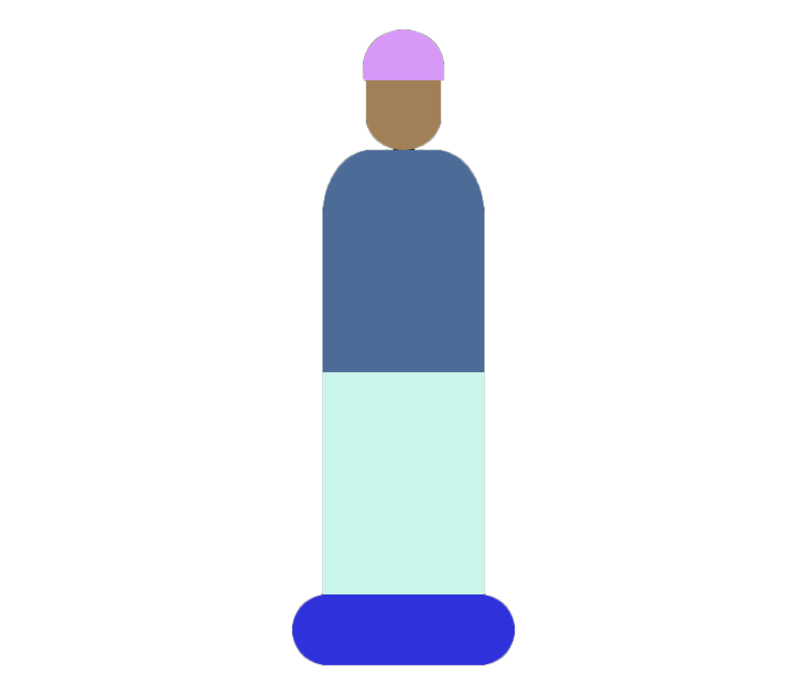
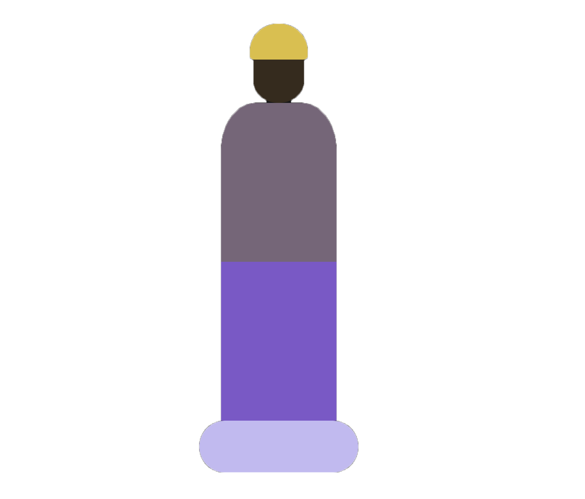
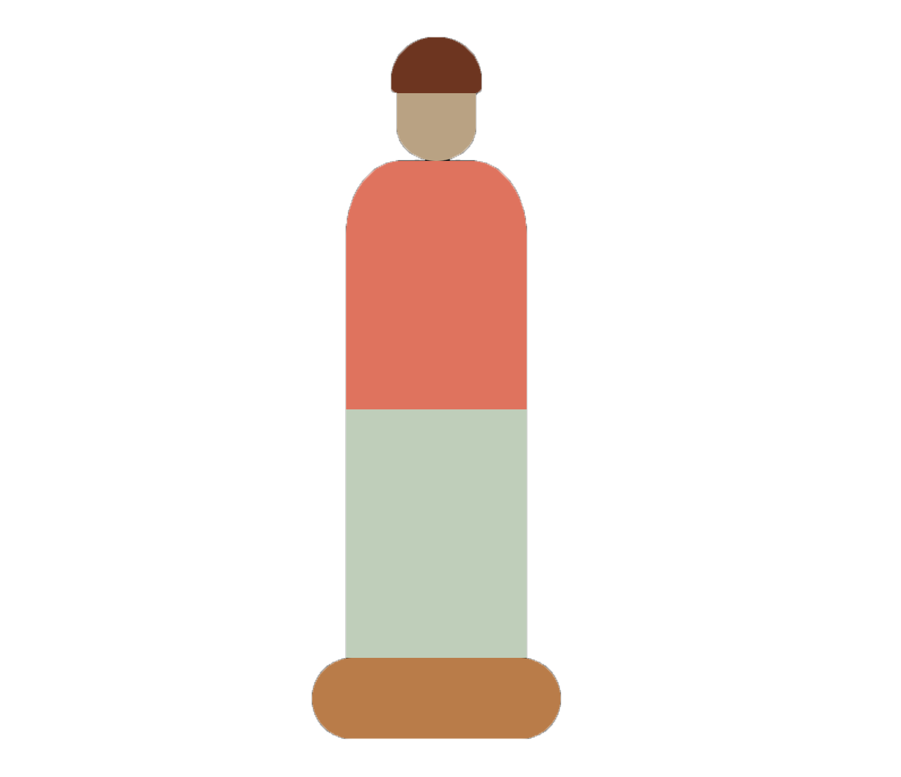
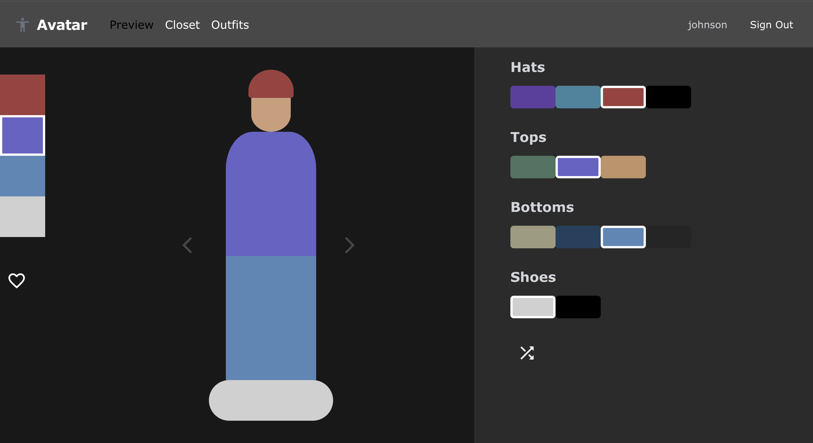
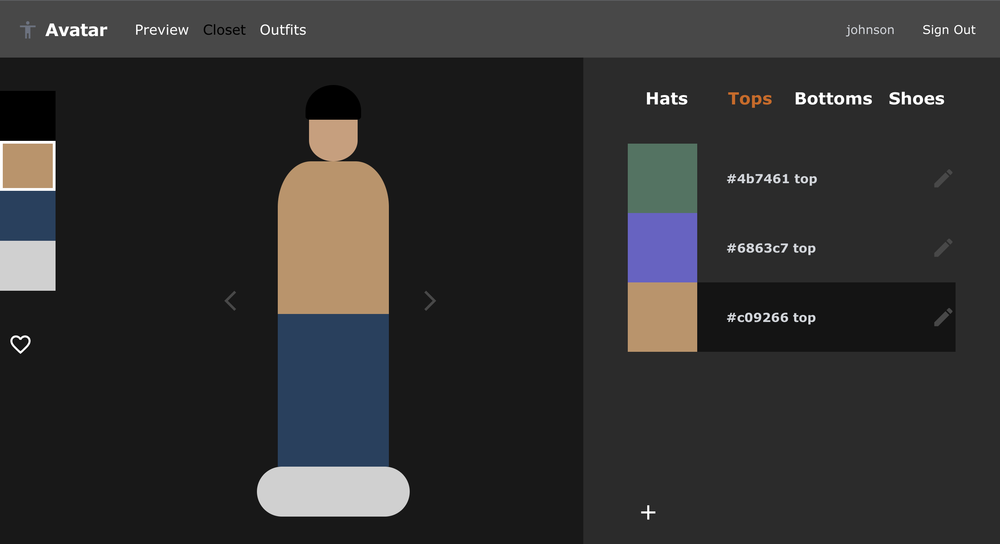
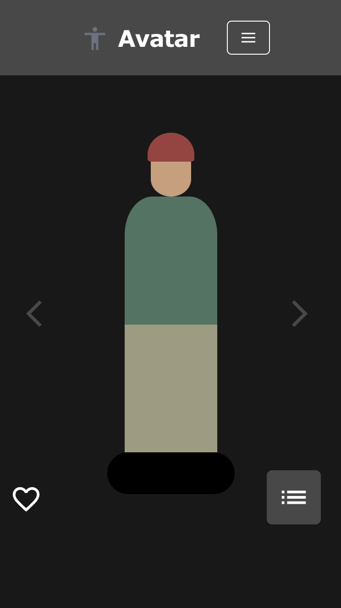
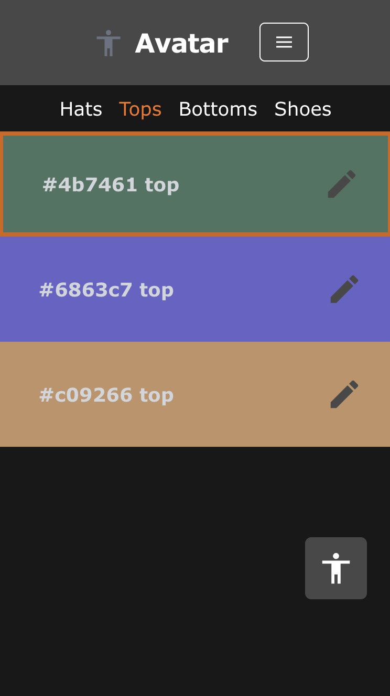
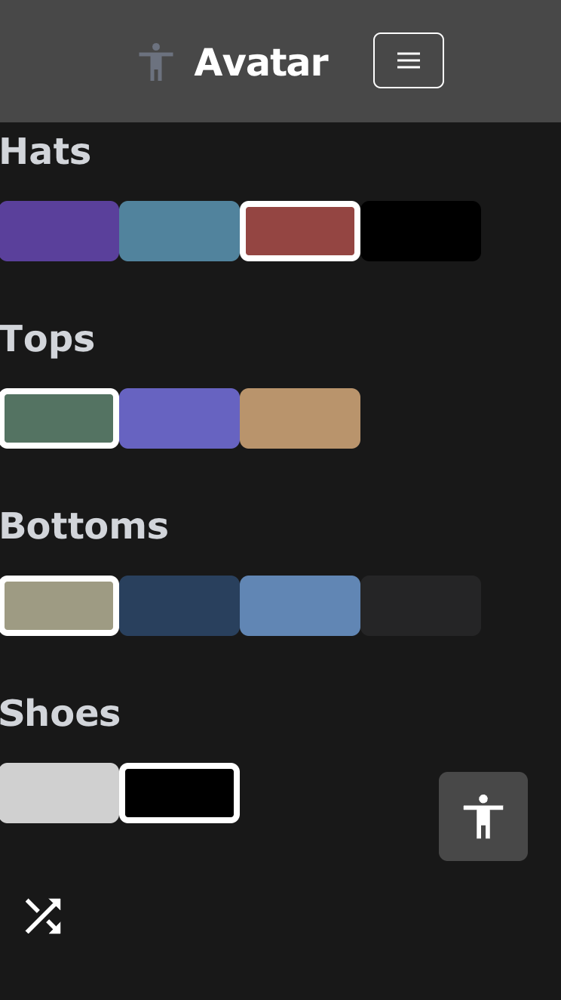

    
    
    

<h1 align="center"><strong>Avatar</strong></h1>

    
    
    
    

## Overview

Avatar is a web application that you can use to manage your wardrobe.

Add garments that you own to your digital closet and preview different outfit combinations on your Avatar character.
<!-- [[ Avatar Demo YouTube video (eventually) ]] -->

Click the Avatar's face to assign your character's complexion.

Click the Avatar's hat, top, bottom, or shoe area to browse through that area's garments.

Select a garment from the garment list to apply it to the Avatar.

## Mobile

Avatar is also available to use on mobile browsers!

    
    
    

---