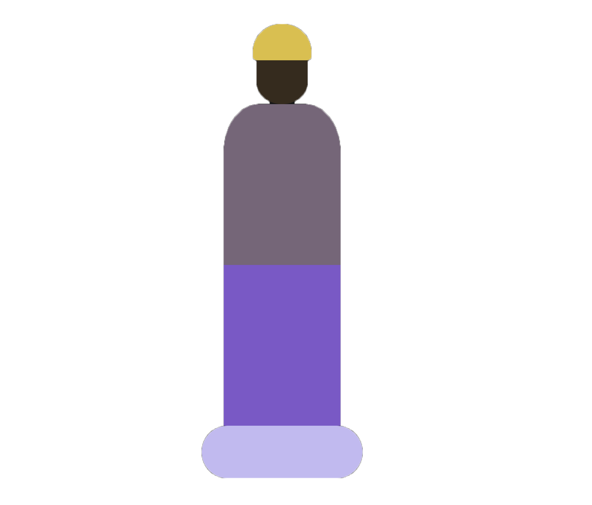
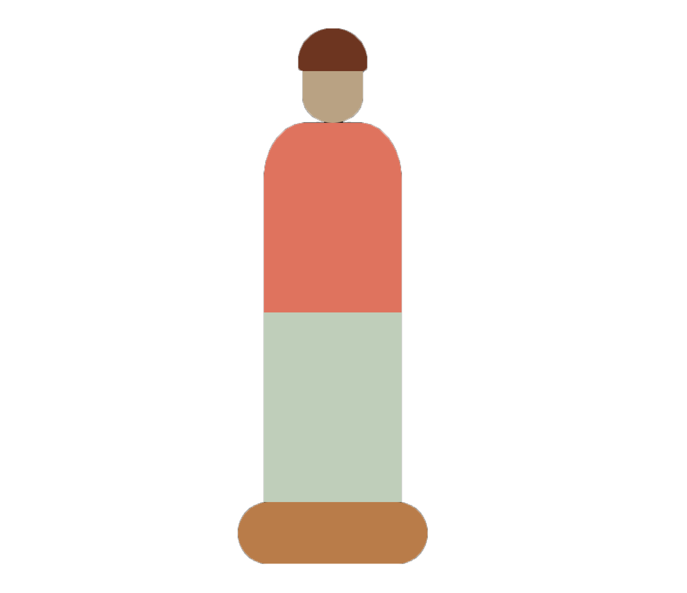
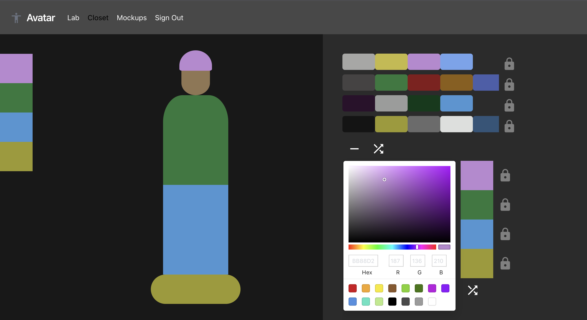
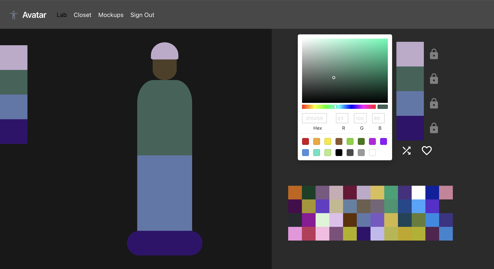
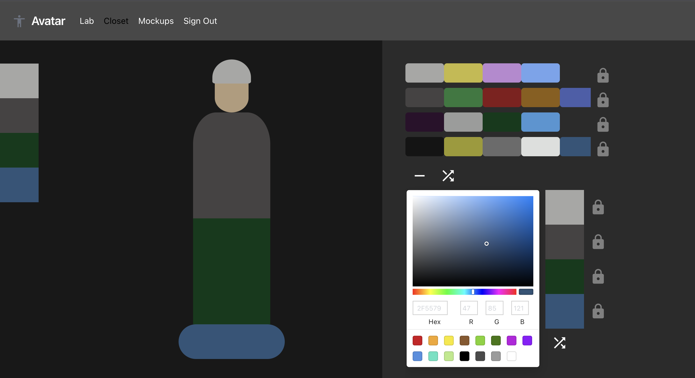
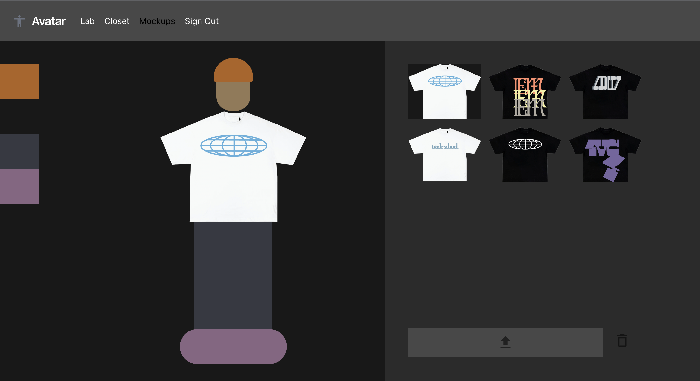

    
    
    

<h1 align="center"><strong>Avatar</strong></h1>

    
    
    
    

## Overview

Avatar is a web application that you can use to manage your wardrobe.

Add garments that you own to your digital closet and preview different outfit combinations on your Avatar.

Identify colors that would integrate well into your wardrobe so you know what pieces you should buy next.

## Walkthrough

<!-- [[ Avatar Demo YouTube video (eventually) ]] -->

The Avatar character is made up of 5 different areas (hat, face, top, bottom, shoe), each of which you can assign the color of.

Click an area on the Avatar to make it the selected area.

Use the color picker and color swatches to change the color of the selected area.

### Modes

Avatar has three different modes: **Lab**, **Closet**, and **Mockup**.

### Lab Mode

Use **Lab** mode to experiment and find outfit color combinations that work well together with the help of the randomize button and color picker.

Click the randomize button to assign random colors to every area.

Lock certain areas to prevent them from being changed by pressing the lock for the corresponding area on the palette.

Save palettes with the heart button (must create an account to save).

Select saved palettes to display palette colors on the Avatar.

### Closet Mode

Use **Closet** mode to save swatches for garments that you own, and preview outfit combinations.

Click areas on the right palette to add or remove a color swatch.

Clicking on a color swatch puts that color in the respective area on the Avatar.

Find pieces that can fit into your wardrobe by locking colors that you own, and then using the randomize button and color picker to find colors that match - can then save palettes

### Mockup Mode

Use **Mockup** mode to upload and manage images of clothing items which you can preview on the Avatar.

Upload a file to be displayed on the Avatar by pressing the upload button on the bottom right of the screen and selecting the a file woth your File Explorer.

Select an uploaded image from the results to preview it on the Avatar.

---

For documentation on the project's implementation, check out the [writeup.md](writeup.md) file!
