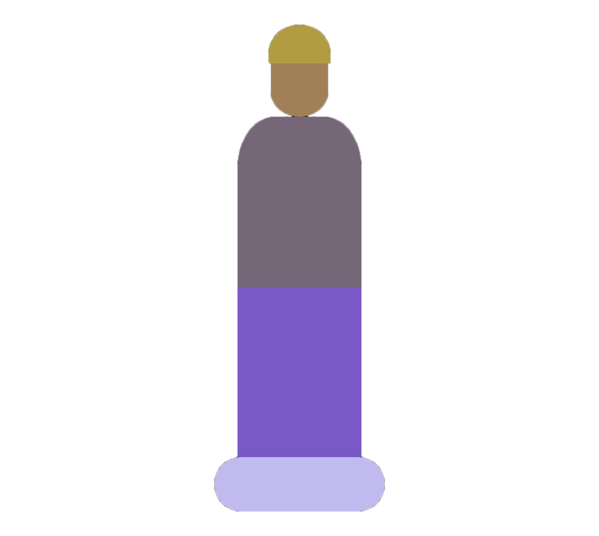

    
    
    
<!--      -->

<h1 align="center"><strong>Implementation Write-Up</strong></h1>

<!-- ## State variables -->

The Avatar is made up of 5 areas: **hat**, **face**, **top**, **bottom**, and **shoe**.

<!-- - **Hat**
- **Face**
- **Top**
- **Bottom**
- **Shoe** -->

Each area's hex color code is stored in a state variable, and user actions trigger functions which update these values.

Each area is a **&lt;div&gt;** element with its **backgroundColor** attribute set to the value of its corresponding state variable.

## System Architecture

This application is built using a mdoern tech stack that leverages cutting-edge technologies for enhanced performance, security, and scalability.

The flowchart below gives a high-level overview of the application's layers and their connections:

  

The architecture consists of the following key components:

### Frontend Application

The frontend is developed using **Next.js**, a versatile React framework that facilitates server-side rendering and seamless navigation.

The frontend is hosted on **Vercel**, a platform known for effortless deployment and fast content delivery.

### Authentication

User authentication is managed through **Cognito User Pools**, a secure and scalable solution that handles user registration, login, and access control. This ensures a streamlined and secure user experience. 

### API

The application communicates with a **GraphQL API** powered by **AWS AppSync**. This API offers real-time capabilities, enabling efficient data retrieval and updates. The API serves as the bridge between the frontend and backend, facilitating seamless interactions.

### Database

Data storage and retrieval are handled by **DynamoDB**, a highly scalable NoSQL database provided by AWS. DynamoDB's flexibility accommodates evolving data needs while ensuring reliable performance.

## Database Schema

[[ Database schema diagram ]]

The database has four tables: **Users**, **Garments**, **Outfits**, **Outfit Assignments**.

The **Users** table is responsible for relating the user id generated from the Cognito User Pool to user settings such as complexion.

The **Garments** table  

The **Outfits** table 

The **Outfit Assignments** table 

## Tools Used

<!-- Jest - used for unit testing

MobX - used for state management

Tailwind CSS - used for styling with ease -->

## Challenges

## Testing

## Next Steps

